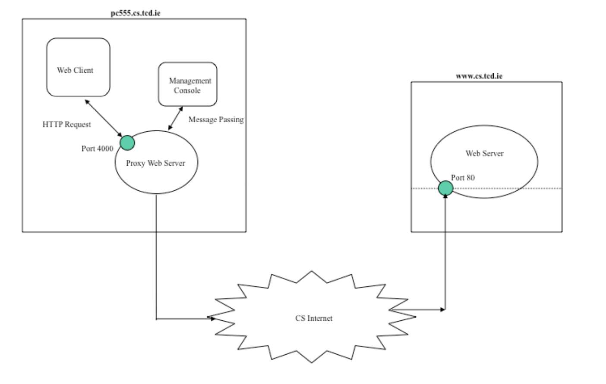

```
 Browser          Proxy Server              Origin Server
    │                   │                          │
    │── Request ───────►│                          │
    │                   │                          │
    │                   ├─ Blocked? ─YES──► 403 ──►│ (close)
    │                   │       NO                 │
    │                   │                          │
    │            ┌──────┴──────┐                   │
    │         CONNECT?        GET/POST             │
    │            │              │                  │
    │          YES              ▼                  │
    │            │        In cache?                │
    │            │         │       │               │
    │            │        YES      NO              │
    │            │         │       │               │
    │            │         │       └── Request ───►│
    │            │         │       ┌── 200 + body ─┤
    │            │         │       │  (store body  │
    │            │         │       │   in cache    │
    │            │         │       │   via Tee)    │
    │            │         │       │               │
    │            │         └─ GET + If-Modified ──►│
    │            │                  Since          │
    │            │           ┌── 304 (no body) ────┤
    │            │           │  (serve body        │
    │            │           │   from memory)      │
    │            │           │                     │
    │◄── 200 ────┤◄──────────┘                     │
    │            │                                 │
    │         200 Tunnel                           │
    │         Established                          │
    │◄───────────┤                                 │
    │            ├─────── TCP tunnel ──────────────┤
    │═══ TLS ════╪════════════════════════════════►│
    │◄══ TLS ════╪════════════════════════════════ │
```

The program should be able to:
1. Respond to HTTP & HTTPS requests and should display each request on a management
console. It should forward the request to the Web server and relay the response to the browser.
2. Dynamically block selected URLs via the management console.
3. Efficiently cache HTTP requests locally and thus save bandwidth. You must gather timing data
to prove the efficiency of your proxy.
4. Handle multiple requests simultaneously by implementing a threaded server.
     